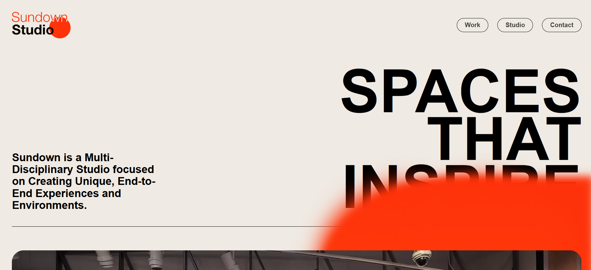

# **Sundown Studio**
A Sleek and Modern Landing Page built with **HTML , CSS , JavaScript** , and powered by **Locomotive Scroll** for Smooth Animations and Parallax Effects.  
This Project focuses on delivering an immersive user Experience with Clean Design, Custom Fonts and engaging Scroll Interactions.  

## ✨ Features
- **Clean & Minimal UI** – Modern layout with smooth design  
- **Custom Fonts** – Neue Haas Grotesk Display Pro for Premium typography  
- **Video Integration** – Background/Section video for Immersive Feel  
- **Interactive Elements** – JavaScript-powered Effects  
- **Responsive Design** – Works across Desktop, Tablet and Mobile
- **Smooth scrolling & animations with [Locomotive Scroll]**

## 🛠 Tech Stack

- **HTML5** – Semantic markup  
- **CSS3** – Styling with Flexbox/Grid & custom animations  
- **JavaScript (ES6+)** – Interactive elements  
- **Locomotive Scroll** – Smooth scrolling & parallax animations  
- **Multimedia** – Video + custom fonts  
- **Google Fonts** – Clean and Modern typography.

## 💡Future Improvements
- **Add advanced animations with JavaScript / GSAP**

- **Implement Dark Mode toggle**

- **Add a functional Shopping Cart**

- **Integrate Product API for Real Data**

## 🎬 Demo Video
- **Sundown Studio Demo** - [▶ Watch the Demo]([./Sundown Studio.mp4](https://github.com/ItsAfjal-Developer/Sundown-Studio/blob/main/Sundown%20Studio.mp4))

## 📸Screenshots

Below is a Preview of **Sundown Studio**, Showcasing the Layout and Styling implemented Using pure HTML , CSS and Javascript. 
The Design focuses on Clean Structure, Responsiveness and Modern Styling.

